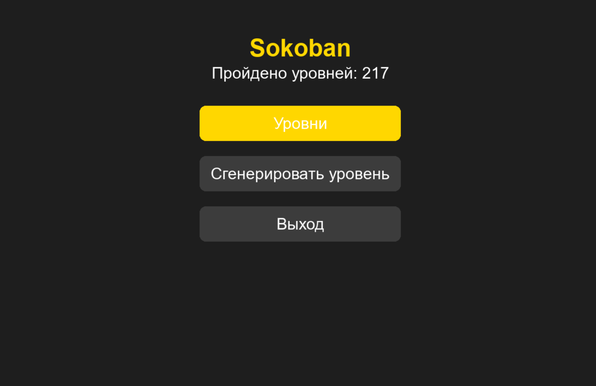
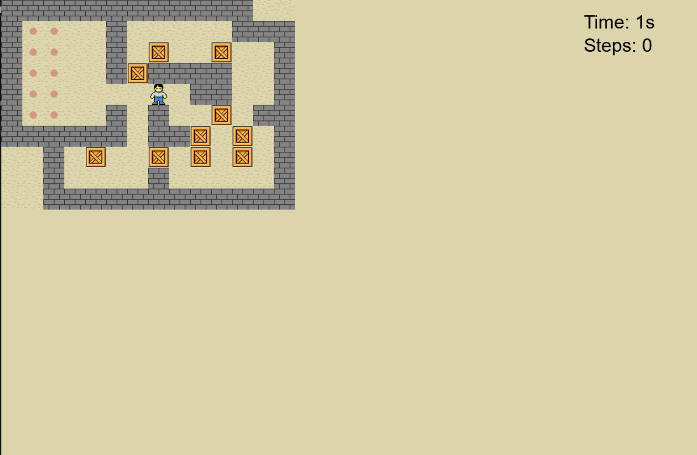

# Sokoban (Сокобан)

Классическая игра-головоломка, в которой вы управляете кладовщиком, перемещающим ящики на целевые позиции.





## Особенности
- Множество уровней
- Возможность генерации случайных уровней
- Отслеживание прогресса
- Система подсказок

## Требования
- Python 3.6+
- Pygame 2.6.1

## Установка
1. Клонируйте репозиторий:
```
git clone https://github.com/yourusername/Sokoban.git
cd Sokoban
```

2. Установите зависимости:
```
pip install -r requirements.txt
```

## Запуск
Запустите игру с помощью команды:
```
python main.py
```

## Управление
- Стрелки (↑,↓,←,→): Перемещение персонажа
- R: Перезапуск уровня
- S: Запустить Solver
- ESC: Вернуться в меню 
- T: Сменить тему
